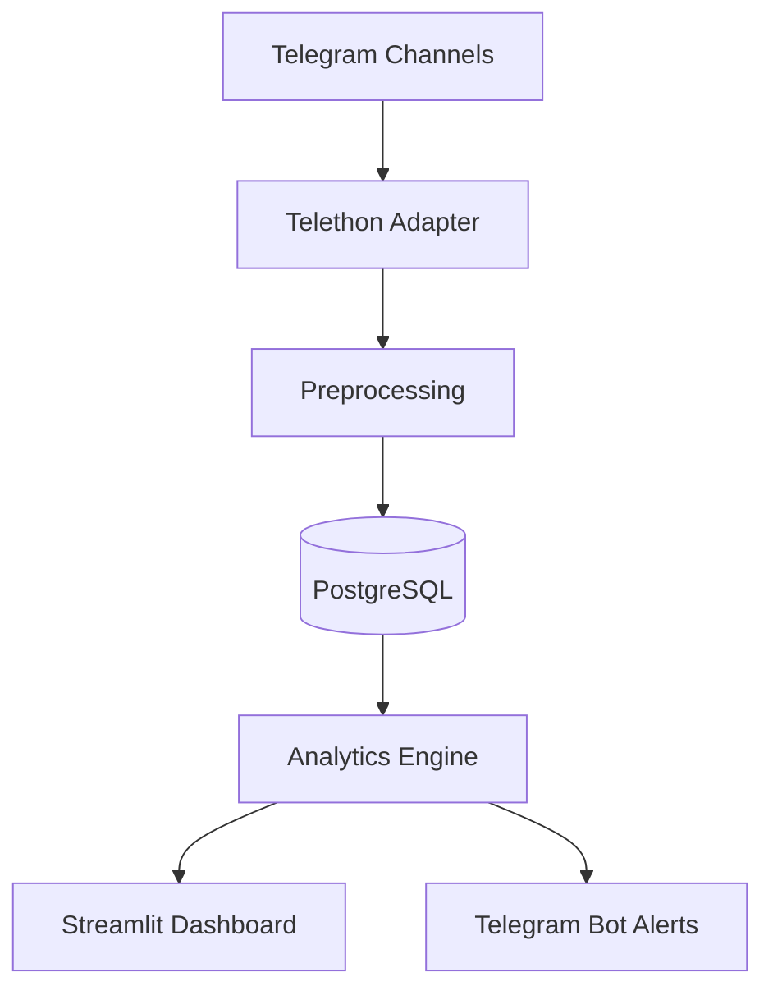

# 🚀 Trendwatch — Telegram Hype Analyzer

<p align="center">
  <b>Open-source система для анализа трендов в Telegram</b><br>
  Отслеживай хайп, находи новые темы, смотри аналитику в реальном времени 📈
</p>


---

## ✨ Возможности
- 📥 Сбор сообщений из публичных **Telegram-каналов** (через Telethon)
- 🗄 Хранение данных в **PostgreSQL**
- 🧹 Очистка текста (эмодзи, ссылки, стоп-слова)
- 🔎 Выделение ключевых слов и хэштегов
- 📊 Метрики трендов:
  - `count` — количество упоминаний
  - `velocity` — скорость роста
  - `novelty` — новые слова за период
- 📺 Красивый **Streamlit Dashboard**
- 🤖 **Telegram-бот** для алертов и команды `/top`

---

## 🛠 Архитектура


---

## 📂 Структура проекта
```bash
trendwatch/
├── README.md                # описание проекта
├── .env.example             # переменные окружения
├── docker-compose.yml       # запуск Postgres
├── requirements.txt         # зависимости Python
├── config/
│   └── settings.py          # конфигурация
├── data/
│   └── stopwords.txt        # стоп-слова
├── ingestion/
│   ├── telegram_client.py   # клиент Telethon
│   └── fetch_messages.py    # сбор сообщений
├── processing/
│   ├── text_cleaner.py      # очистка текста
│   └── term_extractor.py    # выделение слов/хэштегов
├── analytics/
│   ├── trend_engine.py      # расчёт трендов
│   └── scheduler.py         # запуск задач
├── api/
│   └── main.py              # FastAPI (REST API)
├── dashboard/
│   └── app.py               # Streamlit-дэшборд
├── bot/
│   └── bot.py               # Telegram-бот
└── db/
    ├── models.py            # SQLAlchemy модели
    └── migrations/          # alembic миграции
```

---

## 📊 Алгоритм Trend Score
Формула приоритизации трендов:
```math
trend_score = 0.6 * normalized(count)
            + 0.3 * normalized(velocity)
            + 0.1 * novelty
```

---

## 📺 Интерфейсы

### 🖥 Streamlit Dashboard
- 🔎 Фильтр по периоду: `1h` / `6h` / `24h`
- 📋 Таблица: топ-10 трендов (слово, score, count, velocity)
- 📈 График динамики популярности

### 🤖 Telegram Bot
- `/top` → топ-5 трендов прямо в чате
- ⚡ Уведомления при резком всплеске

---

## 📅 Roadmap
- ✅ **Week 1** — Сбор данных (Telethon + PostgreSQL)
- ✅ **Week 2** — Предобработка текста и метрики
- 🔄 **Week 3** — Streamlit Dashboard
- 🔄 **Week 4** — Telegram-бот и алерты

---

## ✅ Критерии готовности
- [ ] Сбор постов минимум из 10 каналов
- [ ] Подсчёт топ-10 слов/хэштегов за период
- [ ] Графики в дашборде
- [ ] Уведомления в Telegram при всплеске
- [ ] Полный запуск через `docker-compose up`

---

## ⚖️ Этичность
- Используются только **публичные данные Telegram**
- Соблюдаются лимиты API
- Персональные данные не сохраняются

---

<p align="center">
  💡 Разрабатывается как pet-project. Любой может <b>форкнуть</b> и доработать 🚀
</p>